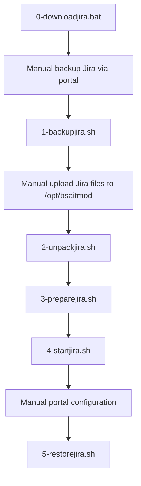

# jirabackup

This file allows you to upgrade your Jira instance through the step-by-step process defined in https://confluence.atlassian.com/adminjiraserver0713/upgrading-jira-applications-964983182.html.
For our purposes, we are going to first install Jira v6.3.12 then migration to 7.0.11, then 7.13.0 and finally to our current release of v8.8.0.

# Installation Steps
Because we are working in an air-gapped (i.e., non Internet accessible) system, we will have to download the files stored under https://github.com/jgoldfed/jirabackup.git. This can be done by either downloading a local git/.zip package or by individually copying each of the scripts located in the repository. Then, the files will need to be uploaded to the RHEL 7 server of your choice.

## Scripts to Execute
Run each of the scripts numerically. The table below shows each script and purpose.
|Script Name|Purpose  |
|--|--|
|0-downloadjira.bat|To be run on local (Windows) machine only. Downloads the .tar.gz files from the Atlassian Product directory. Once downloaded, each file should be sent via SFTP to the RHEL server and stored under the /opt/bsaitmod directory.|
|1-backupjira.sh <6.3\|7.0\|7.13>|Before executing, please backup the Jira instance using the front-end portal under System --> Import and Export -->Backup System. The name should be stored as jira-backup-<6.3\|7.0\|7.13>. This script will then copy the backup folders into the appropriate file.|
|2-unpackjira.sh <7.0\|7.13\|8.8>|Unpacks the prescribed jira tar.gz folder stored in /opt/bsaitmod to the appropriate path|
|3-preparejira.sh|Formats the database and deletes the previous data stored under /var/atlassian/application-data/jira. Please ensure you have created a backup file and executed *1-backupjira.sh* before execution|
|4-startjira.sh <7.0\|7.13\|8.8>|Starts a fresh Jira instance. Note that you will need to log into the front-end portal and run the installation procedure for the database connection. When prompting for restoring a backup, go to the next step.|
|5-restorejira.sh <7.0\|7.13\|8.8>|Restores the Jira backup that you defined earlier (format jira-backup-<6.3\|7.0\|7.13>|
|upgradeto.sh <7.0\|7.13\|8.8>|A quick aggregation that runs through scripts 1 through 4. Execute only if you are sure that each script and upgrade will run without issue.|
|restorejira.sh <7.0\|7.13\|8.8>|The final step (same as *5-restorejira.sh*), to be run only with upgradeto.sh.|
|formatpg.sql|DROPs and CREATEs the data directory supported by *3-preparejira.sh*. This may need to change depending on the database being used.|
## Execution Flow

